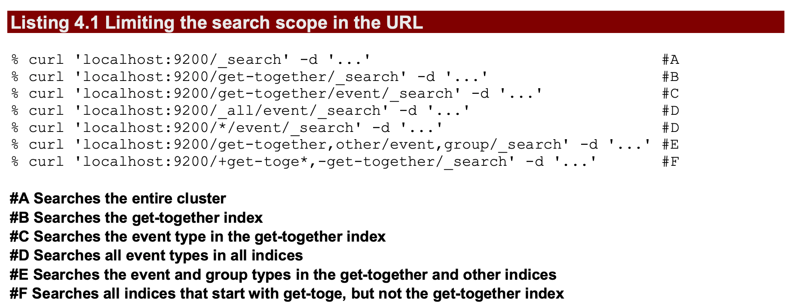
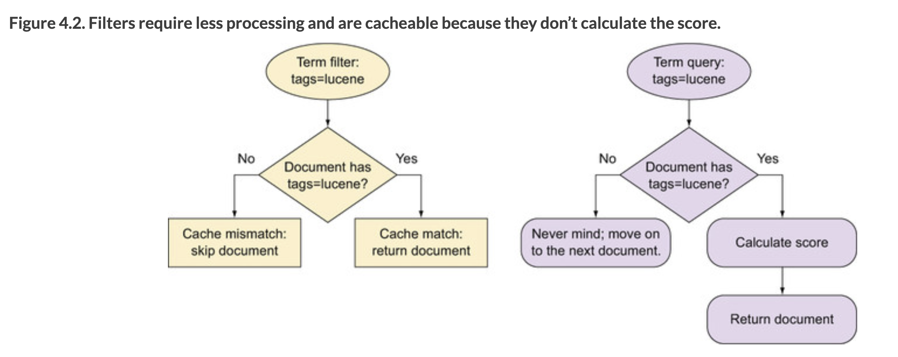
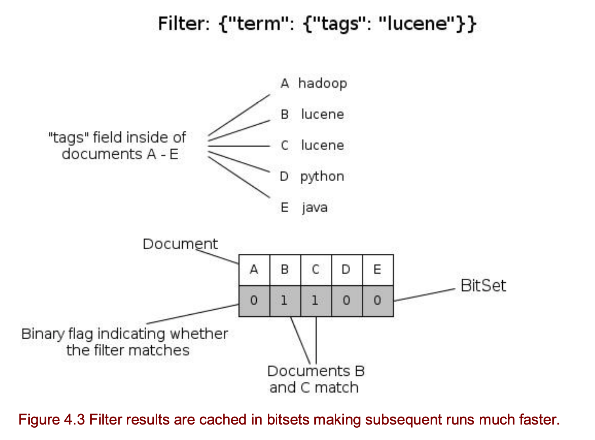
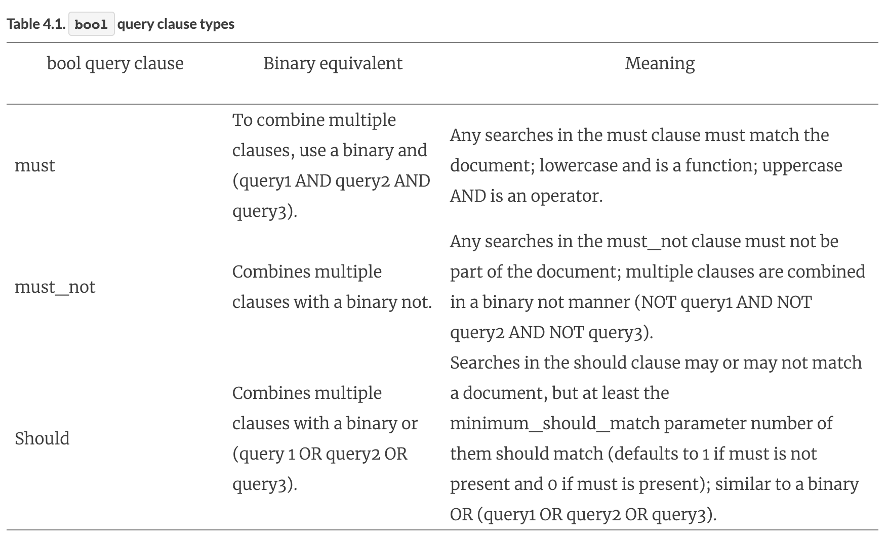

# Ch04 데이터 검색

- 검색 범위 설정하기

    

    - 전체 클러스터
    - 인덱스 이름에 와일드 카드 사용
    - 복수개의 인덱스를 콤마로 연결해서 범위 설정
    - [alias 사](https://www.elastic.co/guide/en/elasticsearch/reference/current/indices-aliases.html)용

        `twitter_201912` 라는 인덱스를 `twitter_latest`  라는 alias 에 추가하기

            POST /_aliases
            {
                "actions" : [
                    { "add" : { "index" : "twitter_201912", "alias" : "twitter_latest" } }
                ]
            }
            
            GET twitter_lastes/_search
            {
             <body>
            }

검색 요청 범위를 제한하면 검색 성능이 향상된다.

## 4.1.2 검색 요청의 기본 구성 요소

- query
    - 도큐먼트 필터링 및 스코어링
    - ex) `elasticsearch` 단어를 포함하는 제목을 가진 문서
- size
    - 반환할 도큐먼트 갯수
- from
    - 문서를 가져올 오프셋 지정, 페이지네이션
- _source
    - 필드를 선택해서 반환
- sort
    - hit 된 문서의 정렬 방법 지정

## URL 기반 검색 요청

- 실제로는 사용하는 일이 없다?

### 결과 문서 크기 및 오프셋 지정

    GET get-together/_search?from=1&size=2

### 정렬 필드 및 정렬 방향 지정

    GET get-together/_search?sort=created_on:asc
    GET get-together/_search?sort=created_on:desc

### 결과에서 원하는 필드 선택

    GET get-together/_search?_source=title,date

## 4.1.3 본문 기반 검색 요청 사용하기

### 결과 문서 크기 및 오프셋 지정

    GET kibana_sample_data_flights/_search
    {
      "query": {
        "match_all": {}
      },
      "from": 10,
      "size": 10
    }

### 결과에서 원하는 필드 선택: _source

    GET kibana_sample_data_flights/_search
    {
      "query": {
        "match_all": {}
      },
      "_source": ["DestCityName", "OriginCityName"]
    }

- 필드명에 와일드 카드 문자 사용 가능
- Case-Sensitive

    GET kibana_sample_data_flights/_search
    {
      "query": {
        "match_all": {}
      },
      "_source": ["Dest*", "Origin*"]
    }

- 제외시킬 필드에 대해서 excludes 사용 가능
- include, exclude 는 Deprecated 됨 (예약어가 바뀜)
    - include → includes
    - exclude → excludes

    GET kibana_sample_data_flights/_search
    {
      "query": {
        "match_all": {}
      },
      "_source": {
        "includes": ["*Name", "*Country"],
        "excludes": ["Dest*"]
      }
    }

### 결과에서 순서 정렬

    GET kibana_sample_data_flights/_search
    {
      "query": {
        "match_all": {}
      },
      "_source": {
        "includes": ["OriginCountry"]
      },
      "sort": [
          {"OriginCountry": "desc"},
          "_score"
        ]
    }

# 4.2 쿼리와 필터 DSL 소개

- 필터와 쿼리의 차이점?
    - 필터는 스코어링 계산을 하지 않는다. 따라서 연산이 빠르고 결과 캐싱이 가능하다.
    - 필터의 결과를 저장하는 비트셋

## 4.2.2 가장 많이 사용되는 기본 검색과 필터

## Match_ALL 쿼리

- 모든 문서와 매치

    GET my_index/_search
    {
      "query": {
        "match_all": {
        }
      }
    }

필터와 같이 사용할 때

    GET my_index/_search
    {
      "query": {
        "bool": {
          "must": { "match_all": {} },  // 이 행은 없어도 동작
          "filter": {
            "term": {"owner": "Pepper"}
          }
        }
      }
    }

## 쿼리 스트링

    {
      "query": {
        "query_string": {
          "query": <query_string>
        }
      }
    }

- 이해하기 어려움
- 쿼리스트링을 term, terms, match, multi_match 쿼리로 변경하는 것을 추천

    name:search^2 AND (tags:lucene OR tags:"big data"~2) AND -description:analytics
    AND created_on:[2006-05-01 TO 2007-03-29]

## Term query

> You can use the term query to find documents based on a precise value such as a price, a product ID, or a username.

- 검색한 텀은 분석되지 않는다
- 공백, 대소문자를 포함한 완전한 일치를 찾는다
- 부스팅 사용 가능

    GET kibana_sample_data_flights/_search
    {
      "query": {
        "term": {
          "DestWeather": "Rain"
        }
      }
    }

    GET kibana_sample_data_flights/_search
    {
      "query": {
        "term": {
          "DestWeather": {
            "value": "Rain",
            "boost": 2.0
          }
        }
      },
      "_source": ["DestWeather"]
    }

- text 필드에는 텀쿼리를 사용할 수 없다.

    PUT my_index
    {
        "mappings" : {
            "properties" : {
                "content" : { "type" : "text" }
            }
        }
    }
    
    
    PUT my_index/_doc/1
    {
      "content":   "Quick Brown Foxes!"
    }
    
    PUT my_index/_doc/2
    {
      "content":   "Slow Brown Cats!"
    }
    
    
    GET my_index/_search
    {
      "query": {
        "term": {
          "content": "Quick Brown Foxes!"
        }
      }
    }
    
    
    GET my_index/_search
    {
      "query": {
        "match": {
          "content": "quick brown foxes"
        }
      }
    }

- 점수가 필요 없는 경우에는 텀 필터를 사용할 수 있다.

### Terms query

- 다중 텀으로 검색

    GET kibana_sample_data_flights/_search
    {
      "query": {
        "terms": {
          "DestWeather": ["Rain", "Sunny"]
          }
      },
      "_source": ["DestWeather"]
    }
    
    
    GET my_index/_search
    {
      "query": {
        "bool": {
          "must": [
            {"term": { "content": "brown" }},
            {"term": { "content": "foxes" }}
            ]
        }
      }
    }

## 4.2.3 매치 쿼리와 텀 필터

- The provided text is `analyzed` before matching.
- 매치 쿼리는 기본적으로  OR 연산을 사용한다.
    - 'Elasticsearch Denver'  텍스트를 검색하면 'Elasticsearch' OR 'Denver' 로 검색한다.

    GET my_index/_search
    {
      "query": {
        "match": {
          "content": {
            "query": "brown slow",
            "operator": "and"
          }
        }
      }
    }

    GET my_index/_search
    {
      "query": {
        "match": {
          "content": "brown slow"
        }
      }
    }

### PHRASE 쿼리 기능

- 텀의 순서 중요
- slop 이라는 토큰 사이의 거리를 표현하는 수치를 옵션으로 지정

    GET my_index/_search
    {
      "query": {
        "match_phrase": {
          "content": "slow cat"
        }
      }
    }
    
    GET my_index/_search
    {
      "query": {
        "match_phrase": {
          "full_text": {
            "query": "brown slow",
            "slop": 2
          }
        }
      }
    }

    GET my_index/_search
    {
      "query": {
        "bool": {
          "must": [
            {"term": { "content": "brown" }},
            {"term": { "content": "foxes" }}
            ]
        }
      }
    }

## 4.2.4 Phrase_prefix 쿼리

[https://www.elastic.co/guide/en/elasticsearch/reference/current/query-dsl-match-query-phrase-prefix.html](https://www.elastic.co/guide/en/elasticsearch/reference/current/query-dsl-match-query-phrase-prefix.html)

The last term of the provided text is treated as a prefix, matching any words that begin with that term.

- 자동완성 기능에 유용

    GET my_index/_search
    {
        "query": {
            "match_phrase_prefix" : {
                "content": {
                    "query" : "quick brown f"
                }
            }
        }
    }

### MULTI_MATCH

- 다중 필드에서 검색

    GET /_search
    {
      "query": {
        "multi_match" : {
          "query":    "this is a test", 
          "fields": [ "subject", "message" ] 
        }
      }
    }

    GET /_search
    {
      "query": {
        "multi_match" : {
          "query" : "this is a test",
          "fields" : [ "subject^3", "message" ] 
        }
      }
    }

    GET /_search
    {
      "query": {
        "multi_match" : {
          "query":    "Will Smith",
          "fields": [ "title", "*_name" ] 
        }
      }
    }

# 4.3 쿼리화 복합 쿼리 결합

## 4.3.1 bool query

tag 의 텀에 tech 가 있는  문서 중에서 user 필드의 텀이 kimchy 이고 tag 의 텀에 wow 또는 elasticsearch 가 있고 age 의 값이 10 미만 또는 20 초과인 문서

    POST _search
    {
      "query": {
        "bool" : {
          "must" : {
            "term" : { "user" : "kimchy" }
          },
          "filter": {
            "term" : { "tag" : "tech" }
          },
          "must_not" : {
            "range" : {
              "age" : { "gte" : 10, "lte" : 20 }
            }
          },
          "should" : [
            { "term" : { "tag" : "wow" } },
            { "term" : { "tag" : "elasticsearch" } }
          ],
          "minimum_should_match" : 1,
          "boost" : 1.0
        }
      }
    }

여기까지

---

## 4.4 매치와 필터 쿼리를 넘어서

## 4.1.1 범위 쿼리와 필터

    GET _search
    {
        "query": {
            "range" : {
                "age" : {
                    "gte" : 10,
                    "lte" : 20,
                    "boost" : 2.0
                }
            }
        }
    }

## 4.4.2 프리픽스 쿼리와 필터

    GET /_search
    {
        "query": {
            "prefix": {
                "user": {
                    "value": "ki"
                }
            }
        }
    }

## 4.4.3 와일드카드 쿼리

# 4.5 존재하는 필드에 필터로 쿼리

## 4.5.1 Exists 필터

특정 필드에 값을 가지는 도큐먼트를 쿼리

## 4.5.3 쿼리를 필터로 변환