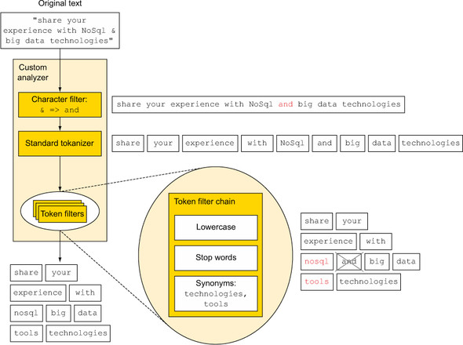
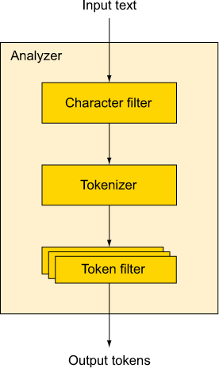

# Chapter5 데이터 분석

- elasticsearch로 텍스트 분석하기
- 분석 API 사용하기
- 토큰화, 필터, 분석기
- Ngram
- Stemming

## Analyze?

- 도큐먼트가 역색인에 추가되기 전에 도큐먼트 본문에서 수행되는 과정
- Example:

    

    1. **Character filter**: 문자열 치환 (& -> and)

        `share your experience with NoSql and big data technologies`

    2. **Tokenizer**: space, newline, dash(-), ...

        `share`, `your`, `experience`, `with`, `NoSql`, `and`, `big`, `data`, `technologies`

    3. **Token filter**: 소문자화, 불용어, 동의어

        `share`, `your`, `experience`, `with`, `nosql`, `big`, `data`, `tools`, `technologies`

    4. **Token Indexing**

### Index time analysis vs Search time analysis

- 검색 텍스트에도 분석이 적용 되는가? -> full text 쿼리일 경우 가능!
    
    1. match/match_phrase: 가능
    2. term/terms: 불가능

## Analyzer 사용하기

1. 색인 생성 시 `settings`로 분석기 사용

    HTML strip Example:

    ```json
    PUT my_index_1
    {
      "settings": {
        "analysis": {
          "analyzer": {
            "my_custom_analyzer": {
              "type": "custom", 
              "tokenizer": "standard",
              "char_filter": [
                "html_strip"
              ],
              "filter": [
                "lowercase",
                "asciifolding"
              ]
            }
          }
        }
      }
    }
    ```

    ```json
    POST my_index_1/_analyze
    {
      "analyzer": "my_custom_analyzer",
      "text": "Is this <b>déjà vu</b>?"
    }
    ```

    Mapping character Example:

    ```json
    PUT my_index_2
    {
      "settings": {
        "analysis": {
          "analyzer": {
            "my_custom_analyzer": { 
              "type": "custom",
              "char_filter": [
                "emoticons"
              ],
              "tokenizer": "punctuation",
              "filter": [
                "lowercase",
                "english_stop"
              ]
            }
          },
          "tokenizer": {
            "punctuation": { 
              "type": "pattern",
              "pattern": "[ .,!?]"
            }
          },
          "char_filter": {
            "emoticons": { 
              "type": "mapping",
              "mappings": [
                ":) => _happy_",
                ":( => _sad_"
              ]
            }
          },
          "filter": {
            "english_stop": { 
              "type": "stop",
              "stopwords": "_english_"
            }
          }
        }
      }
    }
    ```

    ```json
    POST my_index_2/_analyze
    {
      "analyzer": "my_custom_analyzer",
      "text": "I'm a :) person, and you?"
    }
    ```

2. 일래스틱서치 설정 파일(`elasticsearch.yml`)로 전역 분석기 설정

    - pros: 색인 생성 시 전송하는 데이터가 적어짐.
    - cons: 한 번 재시작 해줘야 함. 색인 마다 지정 불가능하여 유연성 떨어짐.

    ```yml
    index:
      analysis:
        analyzer:
          my_custom_analyzer:
            type: custom
            tokenizer: standard,
            char_filter: [html_strip],
            filter: [lowercase, asciifolding]
    ```

3. 매핑 필드에 분석기 설정

    특정 필드에 분석기 지정 Example:

    ```json
    PUT my_index_3
    {
      "mappings": {
        "document": {
          "properties": {
            "text": { 
              "type": "text",
              "fields": {
                "english": { 
                  "type":     "text",
                  "analyzer": "english"
                }
              }
            }
          }
        }
      }
    }
    ```

    ```json
    GET my_index_3/_analyze 
    {
      "field": "text",
      "text": "The quick Brown Foxes."
    }
    ```

    ```json
    GET my_index_3/_analyze 
    {
      "field": "text.english",
      "text": "The quick Brown Foxes."
    }
    ```

    특정 필드에 분석 하지 않도록 지정 Example:

    ```json
    PUT my_index_4
    {
      "mappings": {
        "group": {
          "properties": {
            "name": {
              "type": "text",
              "analyzer": "standard",
              "fields": {
                "raw": {
                  "index": "not_analyzed",
                  "type": "text"
                }
              }
            }
          }
        }
      }
    }
    ```

## Analyzer API

1. API Example:

    ```bash
    curl -XPOST 'localhost:9200/_analyze' \
    -H 'Content-Type: application/json' \
    -d '{
      "analyzer": "standard",
      "text": "share your experience with NoSql and big data technologies"
    }' | python -m json.tool
    ```

2. Tokenizer, Filter 조합하기 Example:

    ```bash
    curl -XPOST 'localhost:9200/my_index_1/_analyze' \
    -H 'Content-Type: application/json' \
    -d '{
      "tokenizer": "whitespace",
      "filter": ["lowercase"],
      "text": "share your experience with NoSql and big data technologies"
    }' | python -m json.tool
    ```

3. 필드 매핑 기반 Example:

    ```bash
    curl -XGET 'localhost:9200/my_index_3/_analyze' \
    -H 'Content-Type: application/json' \
    -d '{
      "field": "text.english",
      "text": "The quick Brown Foxes."
    }' | python -m json.tool
    ```

4. _termvector

## 내장 분석기, 토크나이저, 토큰 필터



1. Built-in Analyzer

    - **standard**: default 텍스트 분석기, 유럽권에 주로 알맞음
      - tokenizer: standard
      - token filter: standard/lowercase/stop

    - simple: 유럽권에서만 사용하며 아시아권 잘 맞지 않음
      - tokenizer: lowercase

    - whitespace: 단순 whitespace로 분해
      - tokenizer: whitespace

    - stop: 단순 불용어 필터
      - token filter: stop

    - keyword: 필드 전체를 단일 토큰화

    - pattern: 정규표현식 토큰화 (기본 regex: `\W+`)

2. Built-in Tokenizer

    - **standard**
    - keyword
    - letter
    - lowercase
    - whitespace
    - pattern
    - uax_url_email
    - path hierarchy

3. Built-in Token filter

    - **standard**
    - lowercase
    - length
    - stop
    - truncate
    - trim
    - limit_token_count
    - reverse
    - unique
    - asciifolding
    - synonym

## Ngram, edge ngram, shingle

- Ngram? 토큰의 각 단어 부분을 다중 서브 토큰으로 분해

    1. Unigram

        `spaghetti` -> `s`,`p`,`a`,`g`,`h`,`e`,`t`,`t`,`i`

    2. Bigram

        `spaghetti` -> `sp`,`pa`,`ag`,`gh`,`ge`,`et`,`tt`,`ti`

    3. Trigram

        `spaghetti` -> `spa`,`pag`,`agh`,`ghe`,`het`,`ett`,`tti`

    4. min_gram, max_gram

        Min_gram=1, Max_gram=3 Example:

        `spaghetti` -> `s`,`sp`,`spa`,`p`,`pa`,`pag`,`a`, ...

    5. Edge ngram

        Min_gram=2, Max_gram=6 Example:

        `spaghetti` -> `sp`,`spa`,`spag`,`spagh`,`spaghe`

    6. 설정 Example:

    ```json
    PUT my_index_ng
    {
      "settings": {
        "analysis": {
          "analyzer": {
            "my_analyzer": {
              "tokenizer": "my_tokenizer"
            }
          },
          "tokenizer": {
            "my_tokenizer": {
              "type": "ngram",
              "min_gram": 2,
              "max_gram": 6,
              "token_chars": [
                "letter",
                "digit"
              ]
            }
          }
        }
      }
    }
    ```

    ```json
    POST my_index_ng/_analyze
    {
      "analyzer": "my_analyzer",
      "text": "spaghetti"
    }
    ```

- Shingle? 문자가 아닌 토큰 수준의 Ngram

    Example:

    `foo bar baz` -> `foo`, `foo bar`, `foo bar baz`, `baz`, ...

## Stemming
