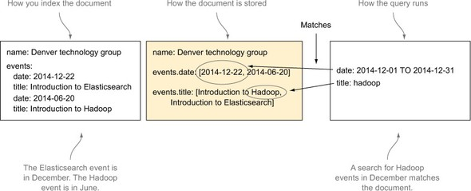
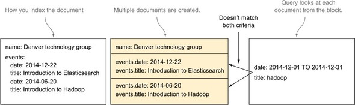
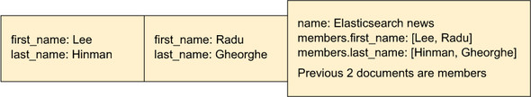
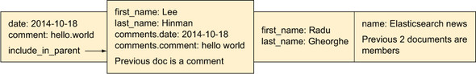
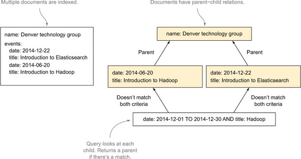
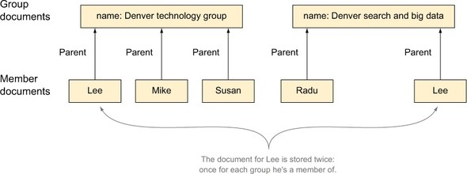
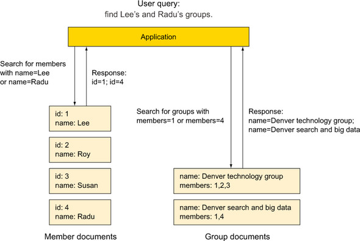

# Chapter08 도큐먼트 간 관계

## Real world vs Flat world

- Real world?

    - 실제 세상에서는 관계가 중요
    - 관계를 고려해서 동작하도록 설계된 것이 관계형 데이터베이스 (Entity, Normalize, ACID transaction, Query-Time Join)

- Flat world?

    - 모든 Document를 서로 **독립적**이고 Flat한 객체로 바라보는 것
    - Elasticsearch를 포함한 다수의 NoSQL이 동작하는 방식
    - 기본적으로, 하나의 Document 내에는 검색을 위한 모든 정보를 포함하는 것이 이상적
    - **pros**
        - 인덱싱, 검색이 빠르고 Lock에 자유롭다
        - 대용량의 데이터를 모든 노드에 고르게 저장할 수 있다, 즉 분산 시스템에 적합하다
    - **cons**
        - 관계형 연산이 어렵다

## Options

1. Object datatype
2. Nested datatype
3. Join datatype (Parent/Child Relation)
4. Denormalizing
5. Application-side Join

## Object datatype

- 도큐먼트 필드 값으로 JSON 객체를 가지는 데이터 타입
- 기본 타입이므로 명시할 필요 없음
- 엘라스틱서치는 내부적으로 필드의 계층 구조를 flatten하여 단순한 구조로 만듬

    ```json
    {
      "group" : "presidents",
      "name" : [ 
        {
          "first" : "Jongun",
          "last" :  "Kim"
        },
        {
          "first" : "Donald",
          "last" :  "Trump"
        }
      ]
    }
    ```

    Internally flatten:

    ```json
    {
      "group" :        "presidents",
      "name.first" : [ "donald", "jongun" ],
      "name.last" :  [ "kim", "trump" ]
    }
    ```

### Mapping and Indexing

- 기본적으로 Object의 매핑은 자동으로 감지 함

    Example:

    ```json
    PUT object_index/_doc/1
    {
      "group" : "presidents",
      "name" : [ 
        {
          "first" : "Jongun",
          "last" :  "Kim"
        },
        {
          "first" : "Donald",
          "last" :  "Trump"
        }
      ]
    }
    ```

    매핑 확인:
    
    ```json
    GET object_index/_mapping
    ```

- 내부 개체의 값이 JSON의 배열이어도 동일하게 동작

    아래 두 도큐먼트의 매핑은 동일함:

    ```json
    {
      "group" : "presidents",
      "name" : {
        "first" : "Jongun",
        "last" :  "Kim"
      }
    }
    ```

    ```json
    {
      "group" : "presidents",
      "name" : [ 
        {
          "first" : "Jongun",
          "last" :  "Kim"
        },
        {
          "first" : "Donald",
          "last" :  "Trump"
        }
      ]
    }
    ```

### Query

- 필드의 전체 경로를 지정해서 검색 및 집계 가능

    검색 Example:

    ```json
    GET object_index/_search
    {
      "query": {
        "bool": {
          "must": [
            { "match": { "name.first": "Donald" }},
            { "match": { "name.last":  "Trump" }}
          ]
        }
      }
    }
    ```

    terms 집계 Example:

    ```json
    GET object_index/_search
    {
      "aggs": {
        "first_name_cloud": {
          "terms": {
            "field": "name.first.keyword"
          }
        },
        "last_name_cloud": {
          "terms": {
            "field": "name.last.keyword"
          }
        }
      }
    }
    ```

- 일대일 관계에서는 잘 동작하나, 일대다 관계에서 개체의 경계가 모호해지는 문제 발생

    아래 검색에서 예상하지 못한 결과 발생: 

    ```json
    GET object_index/_search
    {
      "query": {
        "bool": {
          "must": [
            { "match": { "name.first": "Donald" }},
            { "match": { "name.last":  "Kim" }}
          ]
        }
      }
    }
    ```

## Nested datatype

- Object datatype의 특수 형태
- 중첩 타입으로 선언된 내부 객체는 개별 루씬 도큐먼트로 색인 됨
- Object vs Nested

    

    

### Mapping and Indexing

- Object datatype과 사용법에 크게 차이 없으나, type에 `nested` 명시

    Example:

    ```json
    PUT nested_index
    {
      "mappings": {
        "properties": {
          "name": {
            "type": "nested" 
          }
        }
      }
    }
    ```

    ```json
    PUT nested_index/_doc/1
    {
      "group" : "presidents",
      "name" : [
        {
          "first" : "Jongun",
          "last" :  "Kim"
        },
        {
          "first" : "Donald",
          "last" :  "Trump"
        }
      ]
    }
    ```

    매핑 확인:

    ```json
    GET nested_index/_mapping
    ```

- cross-object matches? Object와 Nested의 두 조건을 모두 만족해야하는 경우

    - `include_in_root`: 루트 도큐먼트에 중첩 필드를 중복 색인

        

    - `include_in_parent`: 인접한 부모 도큐먼트에 중첩 필드를 중복 색인

        

### Nested Query

- 중첩 쿼리 및 필터를 사용하려면 nested 필드의 경로를 명시해야 함
- 중첩 쿼리/필터로 일반 쿼리/필터를 둘러쌈

    Example1: `name.first=Donald AND name.last=Kim`

    ```json
    GET nested_index/_search
    {
      "query": {
        "nested": {
          "path": "name",
          "query": {
            "bool": {
              "must": [
                { "match": { "name.first": "Donald" }},
                { "match": { "name.last":  "Kim" }} 
              ]
            }
          }
        }
      }
    }
    ```

    Example2: `name.first=Donald AND name.last=Trump`

    ```json
    GET nested_index/_search
    {
      "query": {
        "nested": {
          "path": "name",
          "query": {
            "bool": {
              "must": [
                { "match": { "name.first": "Donald" }},
                { "match": { "name.last":  "Trump" }} 
              ]
            }
          }
        }
      }
    }
    ```

- nested 개체의 접수 집계

    1. `score_mode=avg`: 일치하는 중첩 도큐먼트 개수 평균 점수
    2. `score_mode=total`: 중첩 도큐먼트 점수 요약
    3. `score_mode=max`: 중첩 도큐먼트 점수의 최댓값
    4. `score_mode=none`: 어떤 점수도 총점에 대해 산출하지 않음

- 일치하는 내부 도큐먼트를 확인하려면 nested 쿼리 하위에 `inner_hits` 필드를 추가

    inner_hits Example:

    ```json
    GET nested_index/_search
    {
      "query": {
        "nested": {
          "path": "name",
          "query": {
            "bool": {
              "must": [
                { "match": { "name.first": "Donald" }},
                { "match": { "name.last":  "Trump" }} 
              ]
            }
          },
          "inner_hits": { 
            "highlight": {
              "fields": {
                "name.first": {}
              }
            }
          }
        }
      }
    }
    ```

- 중첩 정렬을 하기 위해서는 `sort` 옵션 사용

    Sort Example:

    ```json
    GET nested_index/_search
    {
      "query": {
        "nested": {
          "path": "name",
          "query": {
            "bool": {
              "must": [
                { "match": { "name.first": "Donald" }},
                { "match": { "name.last":  "Trump" }} 
              ]
            }
          }
        }
      },
      "sort": [
        {
          "name.first.keyword": {
            "mode": "min",
            "order": "asc"
          }
        }
      ]
    }
    ```

- 중첩 집계는 단일 버킷 집계로, `nested`, `reverse_nested`를 지원함

    Example:

    ```json
    GET nested_index/_search
    {
      "aggs": {
        "names": {
          "nested": {
            "path": "name"
          },
          "aggs": {
            "frequent_first_name": {
              "terms": {
                "field": "name.first.keyword"
              }
            },
            "frequent_last_name": {
              "terms": {
                "field": "name.last.keyword"
              }
            }
          }
        }
      }
    }
    ```

## Join datatype (Parent/Child Relation)



- 같은 색인 내에 존재하는 서로 다른 타입의 도큐먼트 간 관계 정의
- 자식 도큐먼트에서 부모 도큐먼트의 ID를 명시하는 방식 (Parent-join)
- 6.0 버전부터 `_parent` 필드가 deprecated 되고 `join` datatype 지원

### Mapping and Indexing

- 매핑의 `relations` 필드를 통해 부모, 자식 관계 정의 가능. key: 부모, value: 자식

    Example:

    ```json
    PUT join_index
    {
      "mappings": {
        "properties": {
          "presidents_cars": { 
            "type": "join",
            "relations": {
              "presidents": "cars"
            }
          }
        }
      }
    }
    ```

    부모(presidents)에 해당하는 문서 생성:

    ```json
    PUT join_index/_doc/1
    {
      "text": "Donald Trump",
      "presidents_cars": {
        "name": "presidents" 
      }
    }

    PUT join_index/_doc/2
    {
      "text": "Kim Jungun",
      "presidents_cars": {
        "name": "presidents" 
      }
    }
    ```
    
    자식(cars)에 해당하는 문서 생성. routing은 부모/자식이 같은 샤드에 존재하도록 명시:

    ```json
    PUT join_index/_doc/3?routing=1
    {
      "text": "BMW i8 Roadster",
      "presidents_cars": {
        "name": "cars", 
        "parent": "1" 
      }
    }

    PUT join_index/_doc/4?routing=1
    {
      "text": "Lamborghini Aventador",
      "presidents_cars": {
        "name": "cars", 
        "parent": "1" 
      }
    }

    PUT join_index/_doc/5?routing=2
    {
      "text": "Ferrari 488 GTB",
      "presidents_cars": {
        "name": "cars", 
        "parent": "2" 
      }
    }
    ```

### Query

> 엘라스틱서치는 Join을 지원하지만 성능에 심각한 저하를 가져올 수 있으므로 비정규화를 사용하도록 권장하고 있음  
> Join 타입의 적절한 사용 케이스는 일대다 관계 중에서도 다수의 엔티티가 하나의 엔티티와 연결되어야 할 경우라고 설명함

- Join은 문서 내 관계 이름을 색인화함: `presidents`, `cars`
- 부모/자식 간의 관계 당 하나의 필드를 생성함 ex) 부모: `presidents` / 자식: `cars` -> 조인 필드: `presidents_cars#presidents`
- 자식 문서 내에는 부모 도큐먼트의 `_id` 값이 들어있음

    전체 도큐먼트 조회:

    ```json
    GET join_index/_search
    {
      "query": {
        "match_all": {}
      }
    }
    ```

    부모 도큐먼트 조회:

    ```json
    GET join_index/_search
    {
      "query": {
        "match": {
          "presidents_cars": "presidents"
        }
      }
    }
    ```

- has_parent, has_child 쿼리를 지원하나, 성능에 심각한 저하를 불러올 수 있음

    `has_parent` Example:

    ```json
    GET join_index/_search
    {
      "query": {
        "has_parent" : {
          "parent_type" : "presidents",
          "query" : {
            "match" : {
              "text": "Donald Trump"
            }
          }
        }
      }
    }
    ```

    `has_child` Example:

    ```json
    GET join_index/_search
    {
      "query": {
        "has_child" : {
          "type" : "cars",
          "query" : {
            "match_all" : {}
          },
          "max_children": 10,
          "min_children": 2,
          "score_mode" : "min"
        }
      }
    }
    ```

- aggregation 지원

```json
GET join_index/_search
{
  "query": {
    "parent_id": { 
      "type": "cars",
      "id": "1"
    }
  },
  "aggs": {
    "parents": {
      "terms": {
        "field": "presidents_cars#presidents", 
        "size": 10
      }
    }
  },
  "script_fields": {
    "parent": {
      "script": {
         "source": "doc['presidents_cars#presidents']" 
      }
    }
  }
}
```

## Denormalizing



- 관계 표현을 위해 같은 데이터를 중복해서 도큐먼트 내부에 포함하는 방법
- NoSQL에서 다대다(Many-to-Many) 관계 표현 시 주로 사용

### 사용 사례

- 분산 시스템에서 네트워크 간 Join의 높은 비용을 save할 수 있다는 장점
    - 중첩 도큐먼트는 같은 샤드의 같은 세그먼트 있도록 루씬 블록에 색인함
    - 부모-자식 도큐먼트는 같은 라우팅 값으로 색인해서 같은 샤드에 속해야 함
- 더 많은 공간을 점유하는 단점
- 중복 데이터가 많기 때문에 관리가 어렵다는 단점 ex) 정보 변경 시 중복 도큐먼트 전부 업데이트 필요
- 일대다 관계로 비정규화 하기: 데이터가 적고 정적이며 쿼리량이 많을 경우 정답. 나머지 케이스는 중첩과 부모-자식 관계를 활용
- 다대다 관계로 비정규화 하기: 거의 모든 케이스에서 정답. 단일 노드에 다대다 관계를 포함시키기 어려움

## Application-side Join



- 개별 색인으로 유지하고 각 관계를 어플리케이션에서 도큐먼트 ID 기반으로 조인

## References

- https://www.elastic.co/kr/blog/managing-relations-inside-elasticsearch
- https://www.elastic.co/guide/en/elasticsearch/guide/master/relations.html
- https://www.elastic.co/guide/en/elasticsearch/reference/current/object.html
- https://www.elastic.co/guide/en/elasticsearch/reference/current/nested.html
- https://www.elastic.co/guide/en/elasticsearch/reference/current/parent-join.html
- https://www.elastic.co/kr/blog/additional-stories-at-elasticon-tour-seoul
